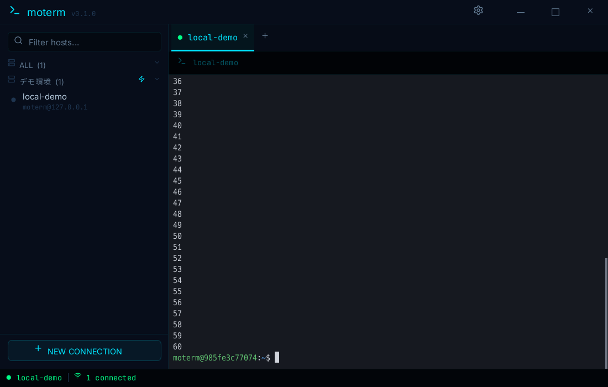
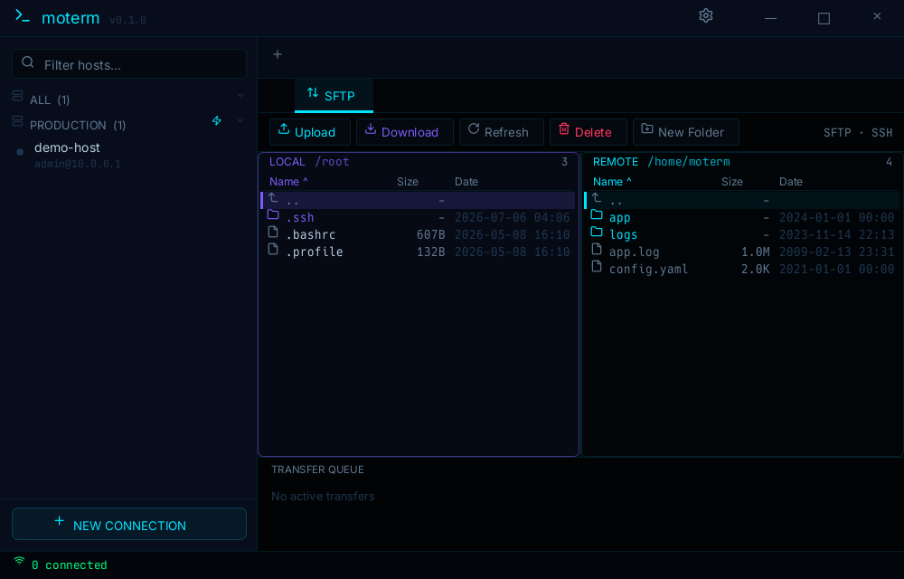

# moterm

[English](README.en.md) | **日本語**

Rust による SSH 専用ターミナルクライアント。
複数の環境へ SSH 接続して開発し、ローカルとの間でファイルをやり取りしつつ、Claude Code / Codex を扱う想定のアプリ。

| 接続中 | SFTP |
|---|---|
|  |  |

## 機能

- **認証・接続**: SSH エージェント / 公開鍵（OpenSSH・PEM・rsa-sha2・未暗号化 `.ppk` 自動変換）/ パスワード、
  TOFU ホスト鍵確認（`~/.ssh/known_hosts` 共有）、マスターパスワード式暗号ボールト（Argon2id + XChaCha20）、
  **踏み台 `proxy_jump`**（純 russh、外部 ssh 不要）/ `proxy_command`、キープアライブ、**自動再接続**（予期しない切断時にバックオフ再試行。`reconnect = { enabled, max_retries, backoff_sec }`）/ F5 手動再接続。
  パスワード/パスフレーズ/マスターパスワードの入力は neon モーダル（表示トグル・クリック送信）
- **SSH 実務機能**: 静的ポートフォワード -L/-R（F2 で端末右上に neon カードで状態表示）、
  `on_connect` 自動入力、セッションログ（生バイト＋プレーンテキスト）
- **SFTP（F3）**: 2ペイン FM（クリック/D&D 転送・進捗バー・ミラー同期 `m`・mkdir/rename/delete・
  列ソート・日付列）、ウィンドウへの D&D アップロード。**接続画面に埋め込み**
  （端末⇄SFTP のサブタブ切替・ツールバー・Transfer Queue。切断で自動クローズ）
- **端末**: SGR 全属性、256色/truecolor、CJK 全角、代替スクリーン、OSC 7/8/52、OSC 133 コマンド境界、
  ブラケットペースト、マウスレポート（vim/htop 等、Shift で抑止）、ウィンドウリサイズで行列が動的に追従
- **タブ/ペイン**: 可変幅タブ（ドラッグ並べ替え・ダブルクリック rename・右クリックメニュー）、
  二分木ペイン分割、ブロードキャスト入力（赤帯）
- **スクロールバック・コピペ**: ホイール/バー（サムドラッグ）/Shift+PageUp/Dn、Ctrl+Shift+F 検索
  （端末上部中央に neon 検索バー・件数表示）、ドラッグ/ダブル/トリプル選択、Alt 矩形、
  Ctrl+クリックで URL を開く
- **フォント**: 既定は同梱の **HackGen Console**（等幅＋日本語、SIL OFL）。OS に未インストールでも
  バイナリ埋め込みで動作し、既定構成ではシステムフォント走査を行わず**起動が速い**。
  `config.font` で別フォントを指定可（その場合も日本語は HackGen で補完）
- **外観・その他**: ウィンドウ透過・ぼかし（Windows は DWM）、組み込みカラースキーム4種、
  i18n（ja/en）、IME、HiDPI、`config.keys` キーバインド上書き、Ctrl+Shift+R 設定リロード

## 動作環境

- Linux（X11/Wayland）/ Windows 10+ / macOS。描画は CPU（winit + softbuffer + fontdue）で GPU 不要
- ウィンドウ透過・ぼかしはコンポジタ（Windows は DWM）有効時のみ実効
- プロトコルは SSH のみ・文字コードは UTF-8 のみ（telnet/シリアル/SJIS 非対応）

## ビルド

```sh
cargo build --release -p mot-gui        # バイナリ: target/release/moterm
```

- **Windows**: `scripts\windows-build.bat`（または `.ps1`）。前提は Rust(MSVC) + VS Build Tools(C++) のみ。
- **macOS**: `scripts/macos-bundle.sh` で Dock アイコン付き `.app` を生成。アイコンは `assets/icon.png`
  差し替えのみ
- この開発ホストのように Rust ツールチェーンが無い環境では Docker でビルドする:
  `docker build -t moterm-dev -f docker/dev.Dockerfile docker` の後 `./docker/run.sh cargo build -p mot-gui`

## 実行

```sh
moterm                    # 設定を自動探索して起動（無ければ既定値）
moterm path/to/moterm.lua # 設定ファイルを明示
```

設定ファイル `moterm.lua` の探索順: ①引数で指定したパス → ②実行ファイルと同じディレクトリ →
③ `~/.config/moterm/`（Windows は `%APPDATA%\moterm\`）。`profiles.json`・暗号ボールトも同じ場所に置かれる。

最小設定例（詳細は `examples/moterm.demo.lua`）:

```lua
local moterm = require "moterm"
local config = moterm.config()
config.profiles = {
  { name = "web1", group = "prod", host = "203.0.113.10", user = "admin",
    auth = { method = "publickey", key = "~/.ssh/id_ed25519" } },
  { name = "db1",  group = "prod", host = "10.0.0.5", user = "admin",
    proxy_jump = "admin@203.0.113.10",           -- 踏み台経由
    auth = { method = "agent" } },
}
config.groups = { { name = "prod", label = "本番環境" } }
return config
```

### 主なキー操作（F1〜F5・タブ切替・コピペ等の14アクションは `config.keys` で変更可）

| キー | 動作 | キー | 動作 |
|---|---|---|---|
| F1 / Ctrl+T | サイドバー Filter | F2 | ポートフォワードパネル |
| F3 | SFTP ファイルマネージャ | F4 | タブを閉じる |
| F5 | 再接続 | Ctrl+PageUp/Dn | タブ切替 |
| Ctrl+Shift+C / V | コピー / 貼り付け | Ctrl+Shift+F | スクロールバック検索 |
| Ctrl+Shift+D | 選択パスを SFTP ダウンロード | Ctrl+Shift+R | 設定リロード |
| Shift+PageUp/Dn | スクロールバック | Ctrl+Shift+B | ブロードキャスト入力 |
| Ctrl+Shift+E / O | ペイン分割（横 / 縦） | Ctrl+Shift+X | ペインを閉じる |
| Ctrl+Shift+矢印 | ペインフォーカス移動 | Ctrl+1〜9 / Ctrl+Tab | タブ切替 |
| Ctrl+Shift+P / N | 前 / 次のプロンプトへ（OSC 133） | | |


## 開発・テスト

検証の統一エントリポイントは `./check`（lint + typecheck + 全テスト。Docker 環境を自動検出）:

```sh
./check                      # lint + typecheck + 全テスト（完了条件）
./check fix                  # 自動整形
./docker/e2e.sh              # 実 sshd 統合テスト（pubkey / password+PF / SFTP / proxy_jump）
./docker/gui-e2e.sh          # GUI→実 sshd の end-to-end（Xvfb + xdotool、スクショ生成）
./docker/reconnect-e2e.sh    # 自動再接続（切断→sshd再起動→復帰）
./docker/neo-sftp-e2e.sh     # 接続画面に埋め込む SFTP の描画
```


## ライセンス

MIT（[LICENSE](LICENSE)）
